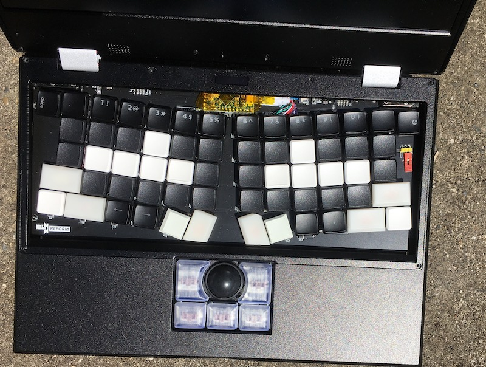

# ergo_reform
ergonomic keyboard remix for the  MNT Reform laptop

This keyboard design is for educational purposes: for me to learn through experimenting, or for for you to educate me. Little remains of MNT's tested design. I have not tested the current version.  Hardware may have dangerous, ignorant or time wasting mistakes. Software is not guaranteed to run or be useful for any purpose. 

## Images

## Changes from MNT reform

* Ergonomic key layout.
* Removed backlight
* Added optional Kailh sockets for switches without RGB backlight. These sockets are cheaper than switches, so I like them in protototypes. While there is room for the sockets above the motherboard, it's only a couple thicknesses of paper. This probably reduces cooling and may permit chort circuits. 
* Removed surface mount Atmega32u4 (cost and chip shortages). Instead it uses the 3 volt Adafruit itsy bitsy. https://learn.adafruit.com/introducting-itsy-bitsy-32u4/pinouts you must hack a USB cable to connect the MCU to the keyboard (see screenprint for "airwire"). You MUST modify the itsyBitsy to disable or remove the 3v3 regulator. Failure to do so may damage the motherboard. 
* Optional power off switch/jumper that can completly remove power to the keyboard.
* Lots of break out pins, so that it should be possible to use the PCB with other MCUs.
* Desktop option for through hole OLED modules. Available from online retailers
* Added partial RGB backlighting. Keys ESC,~,1,2, F, Thumb keys, J, 9,0,-,= have backlights. This is enough to show battery voltage or where to put your hand in the dark. There are jumpers to bypass the top row LEDs, or add separate LED strips. This uses SK Mini-E rgb lights. 

## errata / changelog / todo
* V0 - the pictured version - had the power disconnect on the 5 volt side instead of 3v. ooops. 

# License
This work is derived from work Copyright 2018-2020 MNT Research GmbH.
Modifications Copyright 2022 milestogo are released under the license matching the MNT reform original file or the attached MIT license where not othewise specified.  

The following licenses are used in the project, unless specified differently in a particular subfolder:

- Schematics, PCBs: [CERN-OHL-S v2](https://www.ohwr.org/project/cernohl/wikis/uploads/002d0b7d5066e6b3829168730237bddb/cern_ohl_s_v2.txt)
- Other documentation, artwork, photos and drawings that are not trademarks (see below): [CC-BY-SA 4.0](https://creativecommons.org/licenses/by-sa/4.0/legalcode)
- Software, firmware: Various. [GPL 3.0](https://www.gnu.org/licenses/gpl-3.0.en.html) if not specified otherwise in the file/subdirectory.

The "MNT" and "MNT REFORM" logos are trademarks of MNT Research GmbH. 

## MIT license
Permission is hereby granted, free of charge, to any person obtaining a copy of this software and associated documentation files (the “Software”), to deal in the Software without restriction, including without limitation the rights to use, copy, modify, merge, publish, distribute, sublicense, and/or sell copies of the Software, and to permit persons to whom the Software is furnished to do so, subject to the following conditions:

The above copyright notice and this permission notice shall be included in all copies or substantial portions of the Software.

THE SOFTWARE IS PROVIDED “AS IS”, WITHOUT WARRANTY OF ANY KIND, EXPRESS OR IMPLIED, INCLUDING BUT NOT LIMITED TO THE WARRANTIES OF MERCHANTABILITY, FITNESS FOR A PARTICULAR PURPOSE AND NONINFRINGEMENT. IN NO EVENT SHALL THE AUTHORS OR COPYRIGHT HOLDERS BE LIABLE FOR ANY CLAIM, DAMAGES OR OTHER LIABILITY, WHETHER IN AN ACTION OF CONTRACT, TORT OR OTHERWISE, ARISING FROM, OUT OF OR IN CONNECTION WITH THE SOFTWARE OR THE USE OR OTHER DEALINGS IN THE SOFTWARE.

